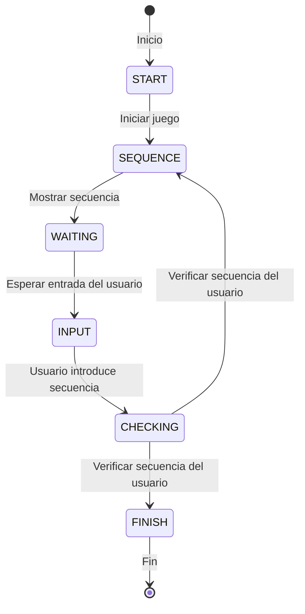
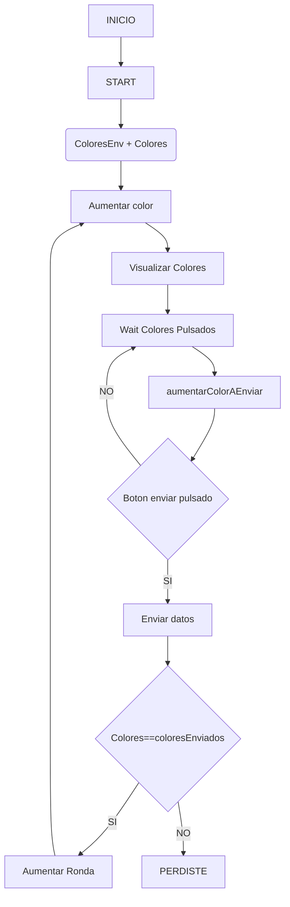

# Proyecto Simon Dice MVVC

Este fascinante proyecto representa mi interpretación del juego Simon Dice, implementado en Kotlin mediante Android Studio. La dinámica del juego consiste en seguir una secuencia de colores que se incrementa en cada ronda exitosa.

## Componentes Clave

### MainActivity.kt
La piedra angular de la aplicación es esta clase principal. Aquí, se inicia el ViewModel y se configura el contenido de la interfaz de usuario. La clase hereda de `ComponentActivity`, una base para actividades que aprovechan la biblioteca Jetpack Compose.

### Data.kt
El núcleo lógico del juego reside en esta clase, abordando estados, colores y secuencias tanto del usuario como del bot. Se hace uso de `MutableState` para gestionar el estado mutable en Compose. Además, se definen dos enumeraciones, `MyColors` y `State`, que representan los colores y estados del juego, respectivamente.

### MyViewModel.kt
En esta clase, se implementa la lógica del juego, generando secuencias aleatorias, evaluando las introducciones del usuario y gestionando los diversos estados. La clase hereda de `ViewModel`, diseñada para almacenar y administrar datos relacionados con la interfaz de usuario de manera consciente del ciclo de vida.

### UI.kt
La interfaz de usuario del juego está encapsulada en esta clase. Se definen botones, registros y rondas, utilizando la biblioteca Jetpack Compose para esbozar la apariencia de la aplicación.

## Evolución de los Estados del Juego

El juego presenta distintos estados, detallados en el archivo `Data.kt`:

- `START`: Estado inicial del juego, permitiendo al usuario iniciar una nueva ronda.

- `SEQUENCE`: Muestra la secuencia de colores que el usuario debe replicar.

- `WAITING`: Estado de espera, en el que el juego aguarda la entrada del usuario.

- `INPUT`: El usuario introduce la secuencia de colores durante este estado.

- `CHECKING`: El juego verifica la corrección de la secuencia introducida por el usuario.

- `FINISH`: Estado final del juego, alcanzado tras una secuencia incorrecta del usuario.

El juego se inicia en el estado `START` y transita entre estos estados en respuesta a las acciones del usuario y del bot.

## Representación Gráfica de los Estados

### Diagrama de flujo

